# Spotify AI Memory System Architecture

## Overview

The project is a music application with durable, explainable listener memory.
The Vue client submits interactions and chat messages to FastAPI. FastAPI
validates each event, writes the immutable record to PostgreSQL, then projects
approved state and memory into Neo4j. The graph is also exposed as an MCP
server so Gemini, Claude, GPT, or another compatible host can use tools.

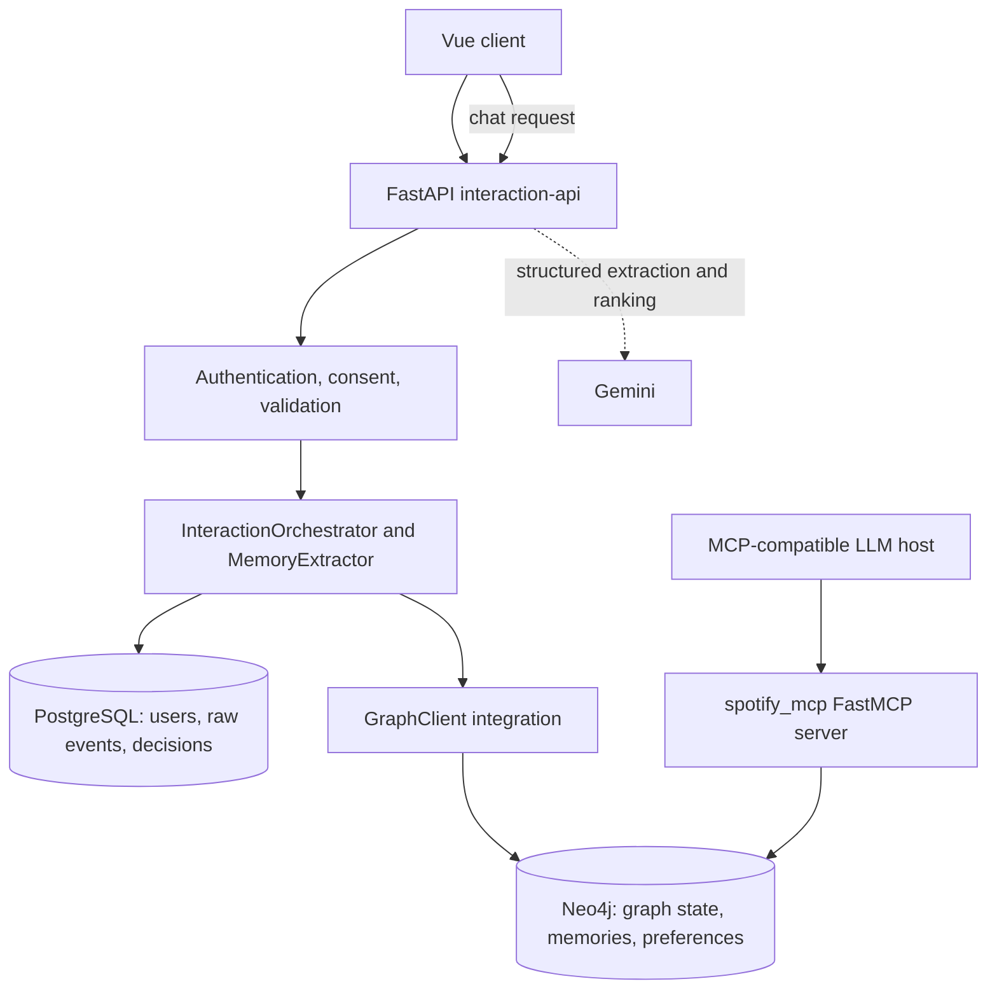

## Components and boundaries

| Component | Responsibility | Key files |
| --- | --- | --- |
| `client/` | Vue views/components, player and chat UI, API requests | `src/services/*`, `src/store/*` |
| `interaction-api/` | HTTP endpoints, auth, consent, event pipeline, chat workflow | `api/`, `orchestrator.py`, `services/chat_workflow.py` |
| PostgreSQL | Immutable event system of record and memory-decision audit | `db/event_repository.py`, `db/memory_decision_repository.py` |
| `graph/` | Domain models, Cypher repositories, graph behavior, reasoning and recommendations | `services/`, `repositories/` |
| Neo4j | Listener state, event history, versioned memories, preference evidence | `neo4j_client.py` |
| `spotify_mcp/` | FastMCP tool/resource interface for graph capabilities | `server.py`, `tools/`, `adapters/graph_adapter.py` |
| Gemini | Optional structured preference extraction and recommendation ranking | `services/chat_assistant.py` |

Rules that keep the system maintainable:

1. The client never writes directly to PostgreSQL or Neo4j.
2. Raw events are persisted to PostgreSQL before graph projection.
3. `GraphClient` is the `interaction-api` boundary into `graph/`.
4. `spotify_mcp/adapters/graph_adapter.py` is the MCP boundary into `graph/`.
5. Repositories own Cypher; services own domain behavior; routes/tools do not
   contain Cypher.
6. Gemini can extract or choose from safe candidates, but cannot override
   validation, memory-retention policy, or deterministic exclusions.

## Data model

PostgreSQL stores `users`, immutable `raw_events`, and `memory_decisions`.
Neo4j contains `User`, `Track`, `Artist`, `Album`, `Playlist`, `Session`,
`Conversation`, and versioned `Memory` nodes.

| Neo4j relationship | Meaning | Lifecycle |
| --- | --- | --- |
| `PLAYED` | Play with timestamp/context/duration | New edge for every event |
| `SKIPPED` | Skip with timestamp/context/duration | New edge for every event |
| `LIKED` | Current track-like state | Merged; deleted by unlike |
| `FOLLOWED` | Current artist/album-follow state | Merged; artist edge deleted by unfollow |
| `HAS_MEMORY` | User owns a memory version | Versioned link |
| `REFERENCES` | Memory refers to a track | Versioned link |
| `PREFERS` | Explicit/derived preference evidence | Updated or recomputed |
| `BY` | Track-to-artist catalog metadata | Catalog state |

A memory has a stable `memory_id` and immutable `version_id`, along with
importance, confidence, validity range, source event, and status. Like/follow
memories also retain canonical action/entity metadata so reversal targets only
the matching state memory. Expired memories remain auditable but are excluded
from retrieval and recommendations.

## Feature workflows

### Authentication and consent

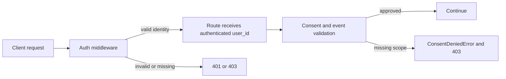

The authenticated identity is authoritative; interaction routes reject a
payload `user_id` that does not match it.

### Play event

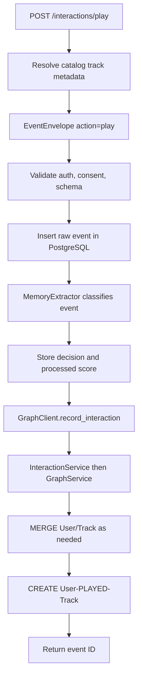

Play relationships are event history: replaying a track creates another
`PLAYED` edge and keeps the full listening timeline.

### Skip event and reasoning tools

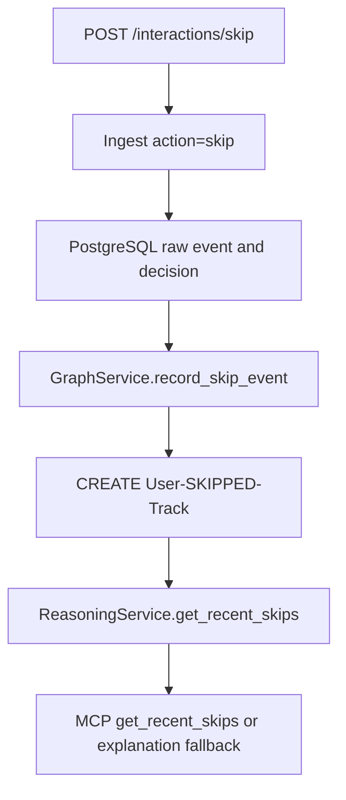

`get_recent_plays` and `get_recent_skips` are both registered MCP tools.
They delegate through `GraphAdapter` and `ReasoningService`, making the same
evidence available to an MCP host and to the application fallback.

### Like and unlike

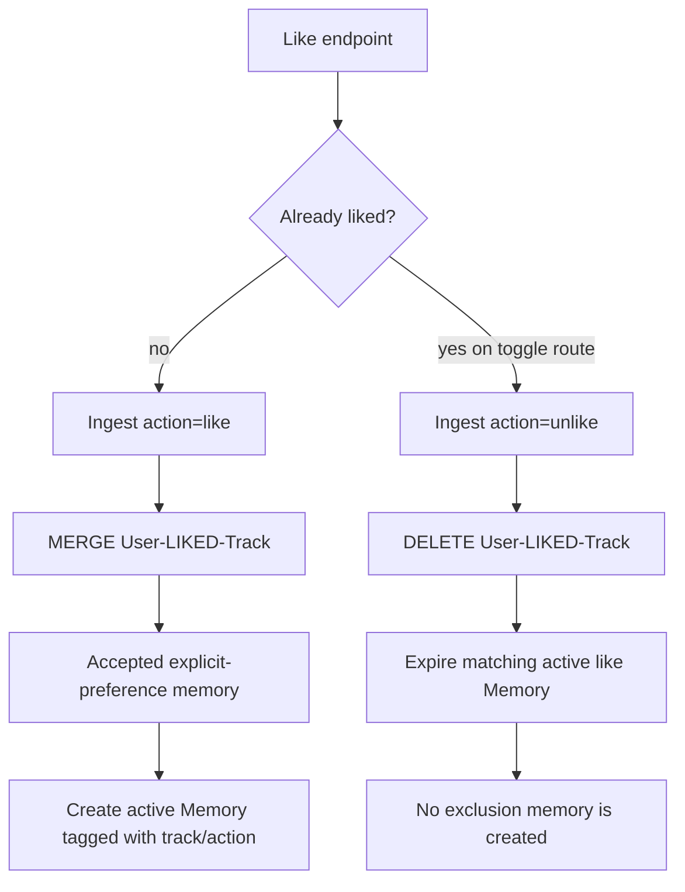

Unlike reverses a stateful preference; it is not interpreted as dislike. The
prior state memory becomes non-retrievable instead of affecting future ranking.

### Follow and unfollow artist

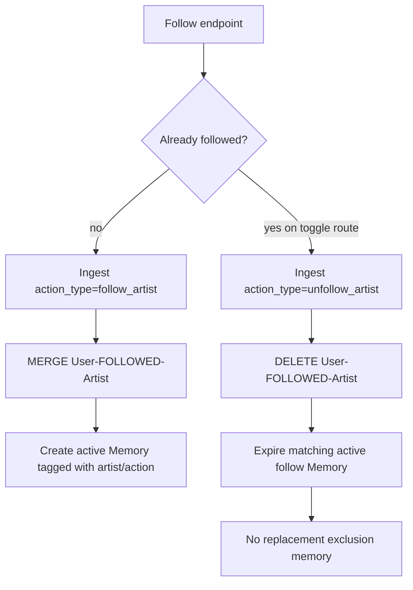

The expiry logic also recognizes legacy state memories that predate the
canonical action/entity metadata.

### Memory decision pipeline

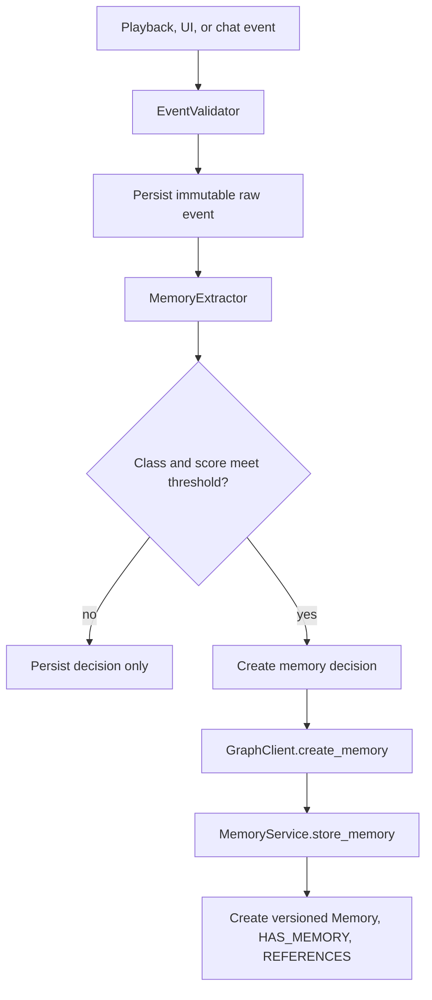

Memory classification and retention are deterministic. It recognizes explicit
preferences, exclusions, corrections, candidate preferences, passive episodes,
and non-memory events. Strength is based on canonical entities, language,
contrast, and signal type; a model cannot make an otherwise rejected event
retrievable.

### Chat and recommendations

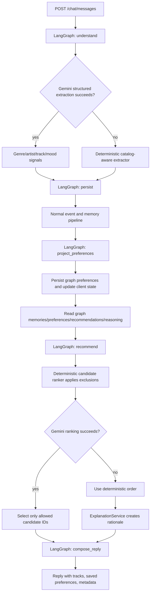

Gemini never receives authority to invent a recommendation; it selects only
from candidate IDs produced after exclusions. If Gemini extraction or ranking
fails, the chat remains functional using deterministic behavior. The ranking
fallback passes persisted preferences, recent plays, and skips to
`ExplanationService` for the user-facing reason.

### Preferences and graph-native recommendations

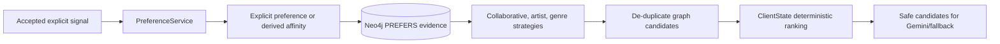

Neo4j is the persisted cross-session preference view. `ClientStateService`
also projects fresh chat signals immediately so the UI can respond while graph
evidence is read or refreshed.

### MCP invocation

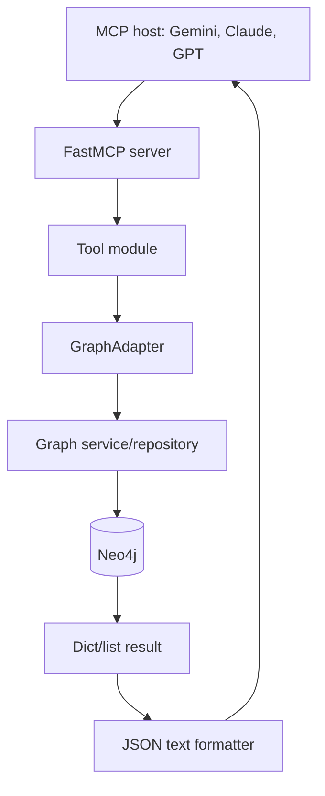

The server supports two deployment modes without changing any tool behavior:

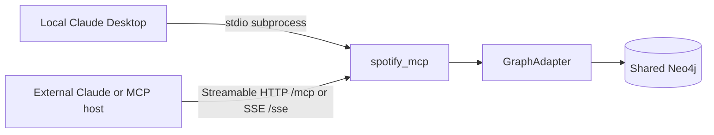

Use `MCP_TRANSPORT=stdio` for a host that launches the process and
`MCP_TRANSPORT=streamable-http` for a host configured with a URL such as
`http://127.0.0.1:8000/mcp`. The HTTP server is configurable with
`MCP_HOST`, `MCP_PORT`, `MCP_STREAMABLE_HTTP_PATH`, `MCP_SSE_PATH`, and
`MCP_STATELESS_HTTP`. Keep an HTTP deployment behind authentication/TLS or a
private network before exposing it beyond the local machine.

Tool modules are grouped by playback, engagement, users/tracks, memories,
recommendations, and reasoning. `server.py` registers every group. The adapter
boundary prevents MCP tools from depending on Cypher or graph internals.

## Failure behavior

| Situation | Result |
| --- | --- |
| Invalid event/auth mismatch/missing consent | Rejected before persistence. |
| PostgreSQL failure | Service-unavailable response; no successful ingest is claimed. |
| Required graph writeback fails | Raw event stays durable in PostgreSQL; caller receives graph-writeback failure. |
| Gemini extraction fails | Deterministic catalog-aware extraction continues the chat workflow. |
| Gemini ranking fails | Deterministic candidate order plus `ExplanationService` rationale. |
| Unlike/unfollow | Current graph edge is deleted and matching state memory is expired. |

## Extension points

- Add an interaction by extending validation, sending it through
  `InteractionOrchestrator.ingest`, and dispatching it in
  `graph/services/interaction_service.py`.
- Add graph behavior in a repository first, then expose it through a service.
- Add an MCP capability with an adapter method and a tool module; register a
  new module in `spotify_mcp/server.py` when necessary.
- Change retention policy in `MemoryExtractor`, never by letting an LLM write
  memories directly.
- Add recommendation strategies in `RecommendationService` and keep model
  output restricted to the resulting candidate set.
