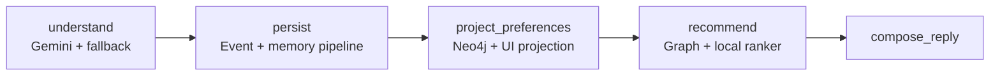

# interaction-api

Implements this slice of the overall architecture:

```
Vue.js Client
     │
     ▼ (Playback Events / Chat / UI Actions)
Interaction API (FastAPI)
     │
     ▼ (Validate + Authenticate + Consent Check)
Event Validation Layer
     │
     ▼ (Valid Versioned Event Contract)
PostgreSQL (Raw Immutable Events)
     │
     ▼
Memory Decision Engine  (naive inline placeholder — see orchestrator.py)
     │
     └─→ writes through to the `graph` package (Neo4j), which `spotify_mcp`
         already reads from via its own graph_adapter/tools.
```

## How this connects to `graph/` and `spotify_mcp/`

- `interaction-api` does **not** call `spotify_mcp` directly, and shouldn't.
  `spotify_mcp`'s tools (`memory_tools.py`, `recommendation_tools.py`, etc.)
  already read from Neo4j via `graph/repositories` + `graph/services`.
- Instead, `interaction-api/integrations/graph_client.py` imports your
  existing `graph.services.*` classes directly and calls into them after
  every event is persisted to Postgres. Once an event is written, it's
  visible to `spotify_mcp` on its next query — no new network hop needed.
- **You will need to adjust `integrations/graph_client.py`**: the method
  names called there (`record_interaction`, `create_memory`,
  `update_preferences_from_event`) are best-guesses based on your file
  names. Open that file and match them to your actual
  `graph/services/interaction_service.py` / `memory_service.py` /
  `preference_service.py` signatures.
- A real `memory-decision-engine` service will eventually replace
  `orchestrator.py`'s `_naive_importance()` heuristic — everything else
  (validation, Postgres insert, graph writeback) stays the same when you
  swap that in.

## Folders

- `api/` — FastAPI app, routes, auth/consent middleware, DI wiring
- `validation/` — schema versioning, payload validation, consent check
- `models/` — event contract, consent, and raw-record pydantic models
- `db/` — Postgres client + append-only `event_repository.py` (added beyond
  the original tree — needed for the "PostgreSQL" box to actually work)
- `integrations/` — bridge into the `graph` package (added beyond the
  original tree — this is the "connects with graph/mcp" piece)
- `orchestrator.py` — ties validation → Postgres → graph writeback together
  (added at the package root, used by `interaction_routes.py`)
- `utils/` — logging, timestamps, exceptions

---

## Testing steps

### 1. Install dependencies

```bash
cd spotify-mem-sys/interaction-api
python -m venv .venv && source .venv/bin/activate
pip install -r requirements.txt
```

### Gemini chat configuration

The browser keeps talking to this FastAPI API; Gemini is the LLM behind the
chat route, not the MCP client. Set the key in the repo-root `.env` before
starting the API:

```bash
INTERACTION_API_GEMINI_API_KEY=your_google_ai_studio_key
# Optional: defaults to gemini-2.5-flash
INTERACTION_API_GEMINI_MODEL=gemini-2.5-flash
```

The chat service uses Gemini structured output to extract separate `genre`,
`artist`, `track`, and `mood` preferences. It then persists the raw chat event
through the normal memory pipeline before updating the recommendation ranker.
For example, “I like Nova Lane's Midnight Circuit but not Neon Rain” becomes
two independent track signals: a like for *Midnight Circuit* and an exclusion
for *Neon Rain*. If no key is configured or Gemini is unavailable, a
catalog-aware deterministic fallback preserves the same flow for local work.

### LangGraph automation

`services/chat_workflow.py` is the orchestrator for every `POST /chat/messages`
request. It keeps the existing Postgres/Neo4j services as the systems of
record, while LangGraph controls the order and state passed between stages:



This is deliberately a per-turn workflow without a LangGraph checkpoint:
conversation and memory durability remain in the project’s existing Postgres
and Neo4j data model. Add a LangGraph checkpointer later only if you need
interrupt/resume or human approval between these nodes.

### Memory decision strength

`MemoryExtractor` is the decision engine. It uses a deterministic 0–1 score,
not an LLM verdict, to decide whether a captured event becomes retrievable
memory. The default retention threshold is `0.55` and is configurable through
`INTERACTION_API_MEMORY_RETENTION_THRESHOLD`.

| Signal | Effect |
| --- | --- |
| Explicit like/dislike, correction, or exclusion | high base score |
| Multiple extracted preferences and canonical entities | increases confidence |
| “love”, “hate”, “never”, contrast/correction phrasing | increases strength |
| Single passive play/skip or vague chat | remains below retention |

The retained score is written to `raw_events.importance_score`, stored as the
Neo4j memory importance/confidence, and scales the preference edge used for
ranking. Gemini receives only retained memory summaries plus their strengths;
it may select and explain tracks from the deterministic candidate list, but it
cannot increase a memory’s strength or bypass exclusions.

### 2. Start Postgres and create the table

Easiest with Docker:

```bash
docker run --name spotify-postgres -e POSTGRES_PASSWORD=postgres \
  -e POSTGRES_DB=spotify_interactions -p 5432:5432 -d postgres:16
```

Apply the migration:

```bash
docker exec -i spotify-postgres psql -U postgres -d spotify_interactions \
  < db/migrations/001_create_events_table.sql
```

### 3. Make sure Neo4j (via your existing `graph` package) is reachable

Your Neo4j Desktop instance should already be running per your existing
setup. Confirm `graph/config.py` points at the same URI/credentials
`interaction-api` will end up using through `graph.neo4j_client.Neo4jClient`.

### 4. Make the `graph` package importable

Run uvicorn from the **spotify-mem-sys root** (one level above
`interaction-api/`) so `graph` resolves as a top-level import:

```bash
cd spotify-mem-sys
export PYTHONPATH=$(pwd):$PYTHONPATH
uvicorn interaction-api.api.main:app --reload --port 8000
```

If `graph` fails to import, the app still starts — `graph_client.py` logs a
warning and disables writeback so you can test the API/Postgres path in
isolation first.

### 5. Check health

```bash
curl http://localhost:8000/health/live
curl http://localhost:8000/health/ready
```
`readiness` should report `"postgres": "ok"` and whether graph writeback is enabled.

### 6. Submit a test event (dev auth bypass via `X-User-Id`)

`settings.debug=True` + `allow_dev_auth_header=True` by default, so you can
skip minting a JWT while testing:

```bash
curl -X POST http://localhost:8000/interactions/events \
  -H "Content-Type: application/json" \
  -H "X-User-Id: user_123" \
  -d '{
        "user_id": "user_123",
        "category": "playback",
        "payload": {"track_id": "track_abc", "action": "like"}
      }'
```

Expected: `201 Created` with the stored `RawEventRecord`, including
`is_important` and `importance_score` from the naive heuristic
(`like` → important).

Try a chat event:

```bash
curl -X POST http://localhost:8000/interactions/events \
  -H "Content-Type: application/json" \
  -H "X-User-Id: user_123" \
  -d '{
        "user_id": "user_123",
        "category": "chat",
        "payload": {"message": "play something upbeat for a workout"}
      }'
```

To exercise the chatbot endpoint directly:

```bash
curl -X POST http://localhost:8000/chat/messages \
  -H "Content-Type: application/json" -H "X-User-Id: user_123" \
  -d "{\"content\":\"I like Nova Lane's Midnight Circuit but not Neon Rain\"}"
```

The response includes `preferencesSaved` and `trackRefs`; `Neon Rain` is
excluded from the client recommendation projection, while the raw message is
saved as a durable memory by the event pipeline.

### 7. Verify idempotency

Resend the exact same JSON body (same generated `event_id` won't repeat
automatically since it's a UUID default — pass an explicit `event_id` to
test the duplicate path):

```bash
curl -X POST http://localhost:8000/interactions/events \
  -H "Content-Type: application/json" -H "X-User-Id: user_123" \
  -d '{"event_id": "11111111-1111-1111-1111-111111111111",
       "user_id": "user_123", "category": "chat",
       "payload": {"message": "test dup"}}'
# repeat the exact same curl -> expect 409 Conflict
```

### 8. Verify consent enforcement

Turn off the bypass in `config.py` (`allow_dev_consent_bypass: bool = False`)
and resend an event for a user with no granted scopes — expect `403` with
`{"error": "consent_required", "missing_scopes": [...]}`.

### 9. Verify it reaches Postgres

```bash
docker exec -it spotify-postgres psql -U postgres -d spotify_interactions \
  -c "SELECT event_id, category, is_important, importance_score FROM raw_events ORDER BY id DESC LIMIT 5;"
```

### 10. Verify it reaches the graph (once `integrations/graph_client.py` is wired to your real method names)

Open Neo4j Browser / Desktop and check that the interaction/memory nodes
created by your `graph.services` calls show up, then confirm `spotify_mcp`'s
tools (e.g. `memory_tools.py`) can see the same data by running an MCP tool
call against it (or via your MCP client/inspector).

### 11. Automated smoke test (optional)

```bash
pip install pytest pytest-asyncio
```
Write a quick `test_health.py` hitting `/health/live` and `/health/ready`
with `httpx.AsyncClient(app=app, base_url="http://test")` — good first CI check
before wiring real Postgres/Neo4j into a test container.
